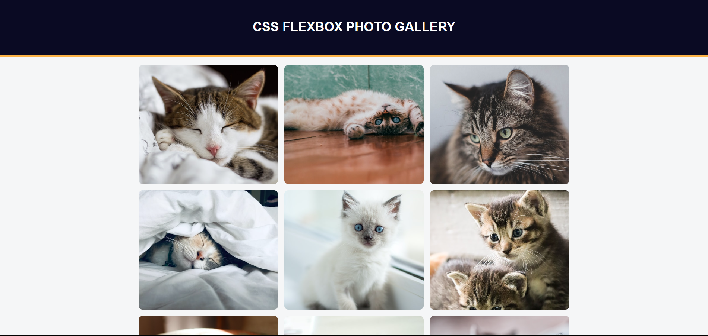

# 🖼️ Flexbox Photo Gallery​

Welcome to the **Flexbox Photo Gallery** repository! This project features a responsive photo gallery built with **HTML5** and **CSS3**, utilizing the power of Flexbox to create an adaptive and elegant layout.

## Layout

    

## 📷 About the Project

Flexbox Photo Gallery was created with the goal of practicing and demonstrating the use of Flexbox in building responsive layouts for image galleries. The project allows images to automatically adjust to the screen size, providing a consistent user experience across multiple devices.​

## 🛠️ Technologies Used

- **HTML5:** Semantic structuring of page content.​

- **CSS3:** Responsive styling and layout using Flexbox.​